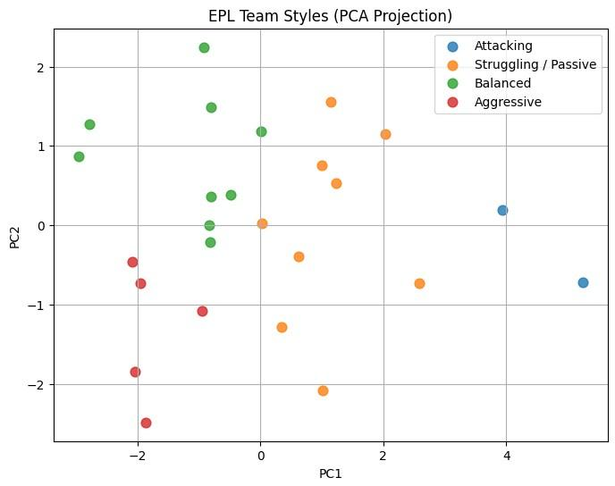

# EPL Team Style Analysis & Match Prediction System




This project applies unsupervised machine learning (KMeans clustering)
to identify playing style patterns among English Premier League teams
based on match-level performance statistics.

---

## 📌 Project Overview
This project applies unsupervised machine learning (KMeans clustering) to identify playing style patterns among English Premier League teams based on match-level performance statistics, supporting data-driven tactical analysis and team profiling.

---

## 🔍 Methodology
- Feature engineering from match-level data
- Team-level aggregation of performance metrics
- Standardization and KMeans clustering
- Cluster interpretation and style labeling
- PCA-based visualization for cluster validation

---

## 📊 Key Insights
- Teams naturally cluster into four playing styles:
  - Attacking
  - Balanced
  - Aggressive
  - Struggling / Passive
- PCA visualization explains ~87% of variance, showing clear separation between styles.
- High attacking output is relatively rare across the league.

---

## 🛠 Tech Stack
- Python
- Pandas, NumPy
- Scikit-learn
- Matplotlib

---

## 📁 Files
- `EPL Team Style Analysis & Match Prediction System.ipynb`: Main analysis notebook
- `README.md`: Project documentation

---

## 🚀 Future Improvements
- Multi-season data integration
- Tactical features (pressing intensity, pass networks)
- Match outcome prediction models

---

## 📁 Project Structure

```

project/
├── data/                 # Raw & processed EPL datasets
├── notebooks/            # EDA, clustering, modeling notebooks
├── dashboard/            # Tableau or Streamlit dashboards
└── README.md             # Project documentation

```
